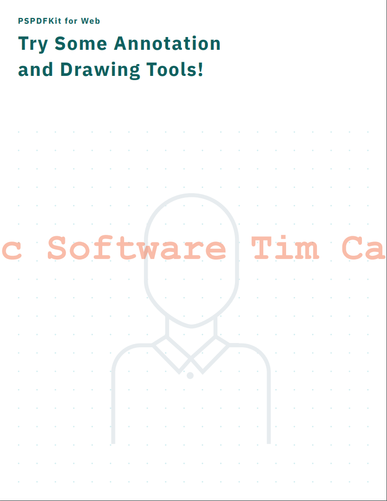
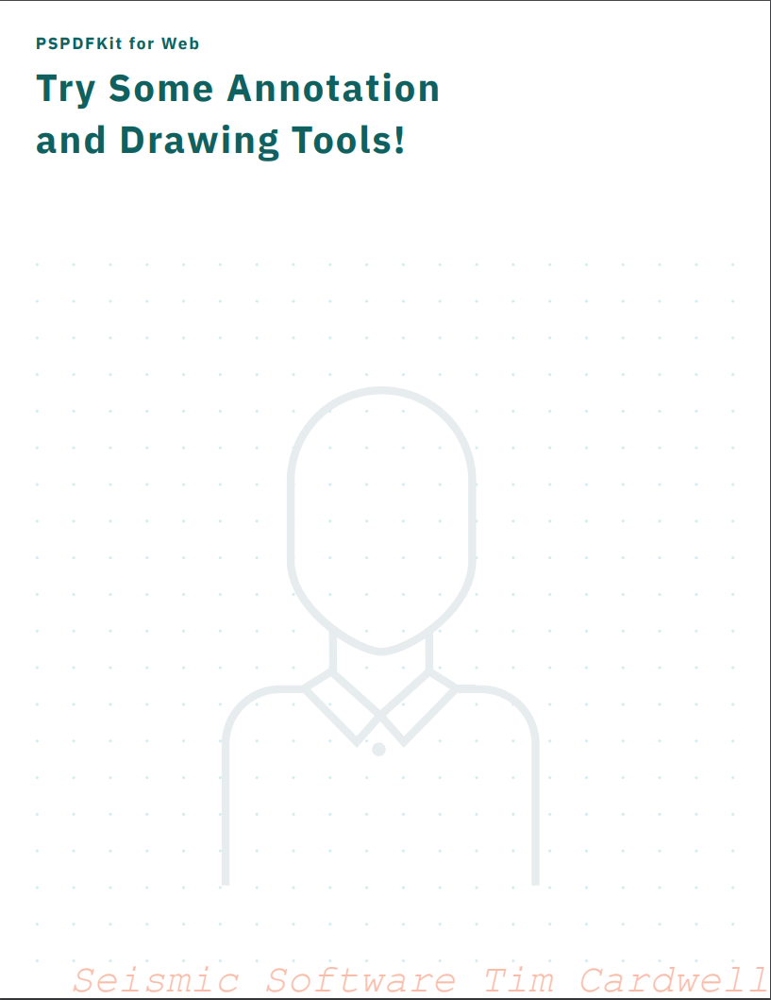
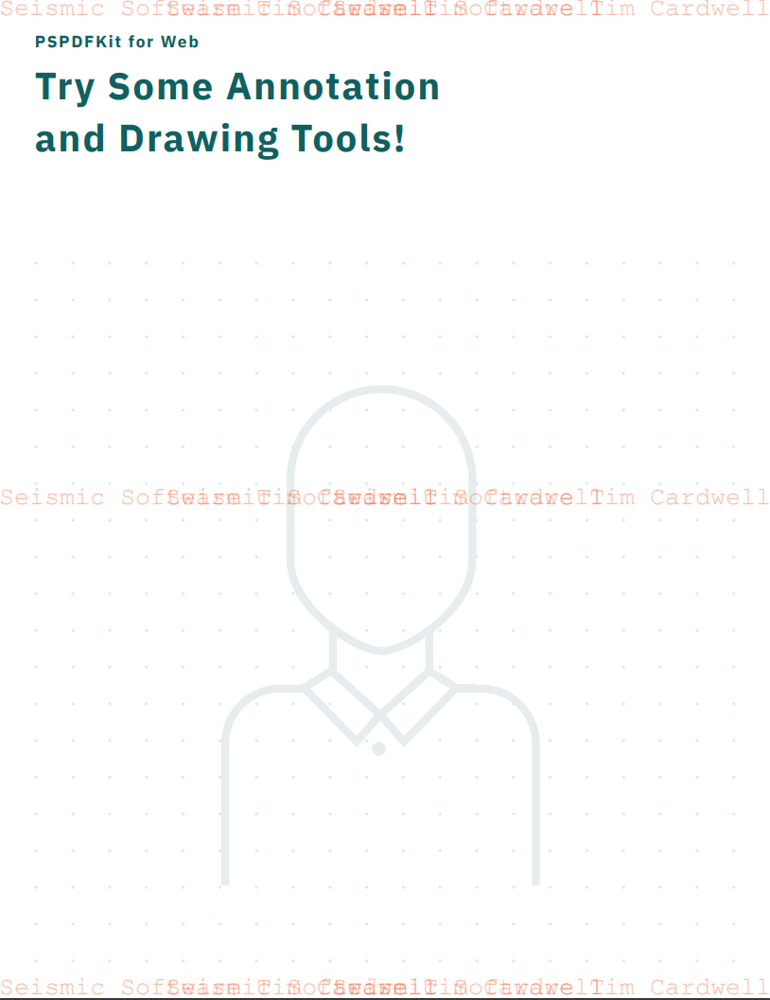
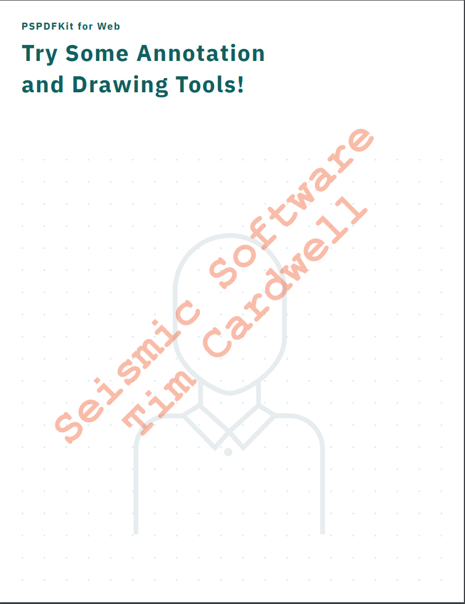
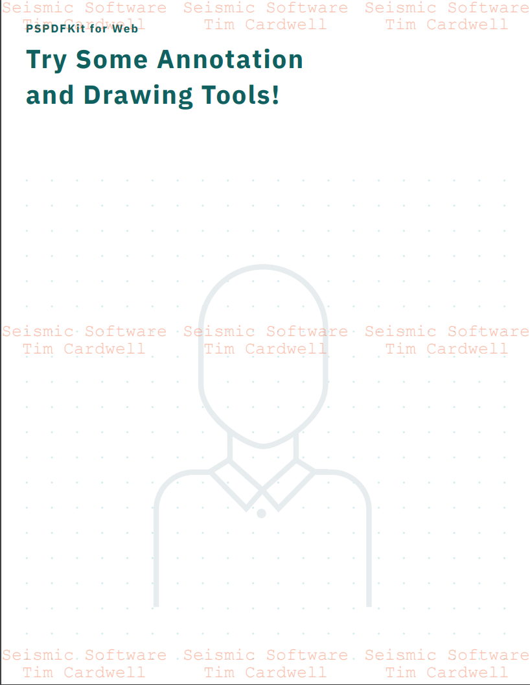
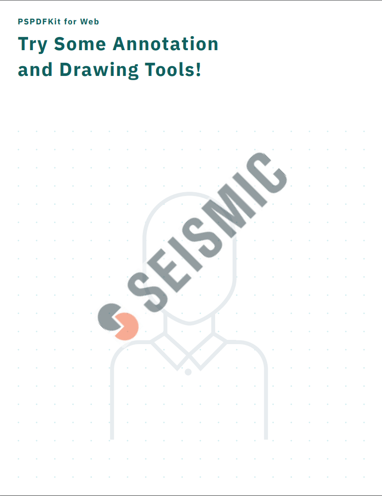
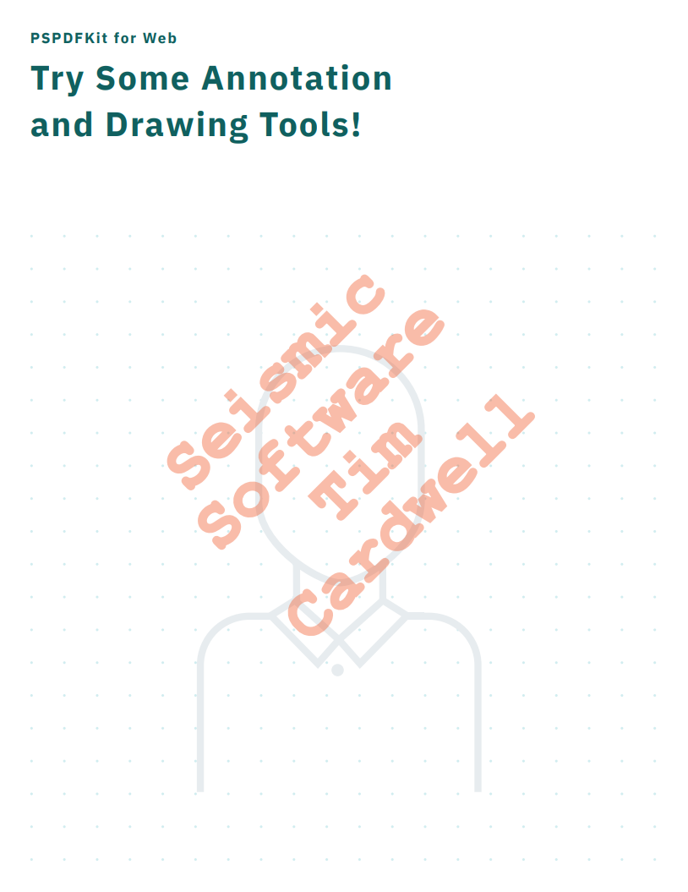
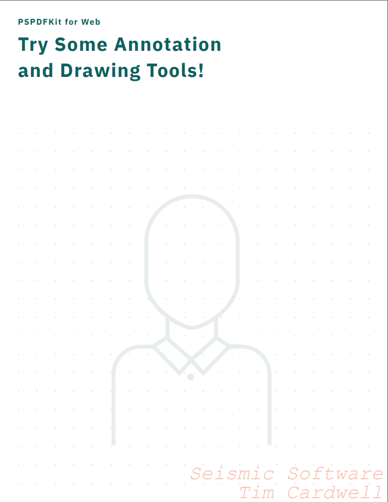
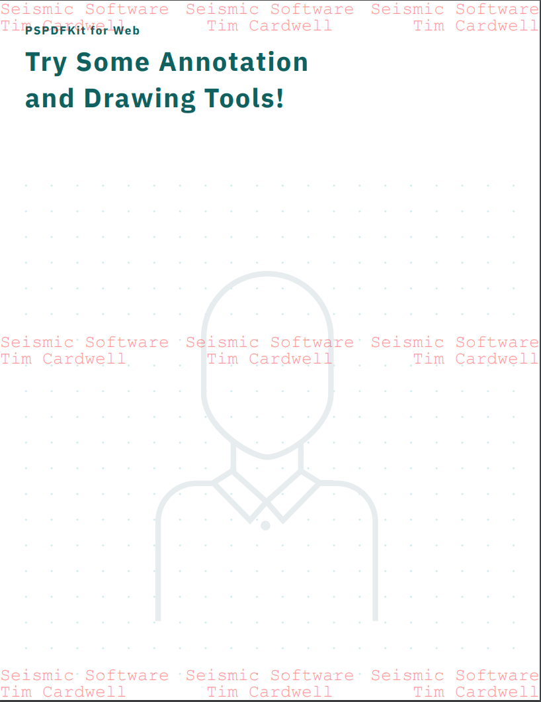
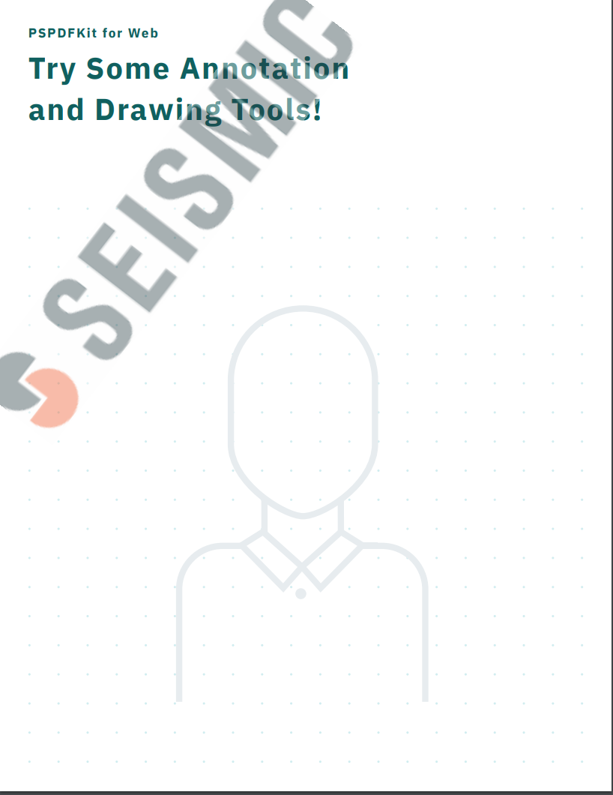

## Overview
A console app that adds watermarking to a variety of PDF content using the following technologies:
- Aspose
- iTextPDF
- Foxit
- PsPdfkit Linux Process

### Goals
This console app is used to answer the following questions:
- Expected watermarking speed
- How to handle edge cases (password protected PDFs, high page count PDFs, high file size PDFs, read-only PDFs, PDFs with forms, etc…)
- Text vs Image watermarking differences
- Flexibility on positioning, font size, font type, orientation, etc…

### Outcomes
#### Aspose
##### Metrics
```
|    Method | SampleFile | WatermarkType | PositionType |      Mean |     Error |    StdDev |       Gen 0 |     Gen 1 |     Gen 2 | Allocate
|---------- |----------- |-------------- |------------- |----------:|----------:|----------:|------------:|----------:|----------:|---------
| Benchmark |     Simple |   TextNewFile |       Center |  76.32 ms |  2.684 ms |  2.983 ms |   8000.0000 | 1000.0000 |         - |     48 M
| Benchmark |     Simple |   TextNewFile |       Footer |  94.39 ms |  4.391 ms |  4.699 ms |   8000.0000 | 1000.0000 |         - |     50 M
| Benchmark |     Simple |   TextNewFile |        Tiled | 341.31 ms | 17.332 ms | 19.264 ms |  60000.0000 | 2000.0000 |         - |    300 M
| Benchmark |     Simple |  ImageNewFile |       Center |  70.57 ms |  4.359 ms |  4.845 ms |   6000.0000 | 2000.0000 |         - |     39 M
| Benchmark |     Simple |  ImageNewFile |       Footer |  89.22 ms | 10.218 ms | 11.357 ms |   6000.0000 | 2000.0000 |         - |     39 M
| Benchmark |     Simple |  ImageNewFile |        Tiled | 384.53 ms |  9.756 ms | 11.235 ms |  48000.0000 | 3000.0000 |         - |    243 M
| Benchmark |       Form |   TextNewFile |       Center |  46.99 ms |  1.842 ms |  2.122 ms |   2000.0000 | 1000.0000 |         - |     20 M
| Benchmark |       Form |   TextNewFile |       Footer |  63.93 ms |  2.207 ms |  2.453 ms |   3000.0000 | 1000.0000 |         - |     21 M
| Benchmark |       Form |   TextNewFile |        Tiled |  78.65 ms |  3.839 ms |  4.422 ms |  14000.0000 | 1000.0000 |         - |     79 M
| Benchmark |       Form |  ImageNewFile |       Center |  37.78 ms |  1.012 ms |  1.166 ms |   2000.0000 | 1000.0000 |         - |     14 M
| Benchmark |       Form |  ImageNewFile |       Footer |  38.08 ms |  1.133 ms |  1.304 ms |   2000.0000 | 1000.0000 |         - |     14 M
| Benchmark |       Form |  ImageNewFile |        Tiled |  87.36 ms |  3.202 ms |  3.559 ms |   9000.0000 | 1000.0000 |         - |     54 M
| Benchmark | Scientific |   TextNewFile |       Center | 175.71 ms |  6.201 ms |  7.141 ms |  19000.0000 | 4000.0000 | 1000.0000 |    115 M
| Benchmark | Scientific |   TextNewFile |       Footer | 206.52 ms |  9.849 ms | 10.538 ms |  21000.0000 | 4000.0000 | 1000.0000 |    117 M
| Benchmark | Scientific |   TextNewFile |        Tiled | 876.99 ms | 64.256 ms | 73.997 ms | 149000.0000 | 8000.0000 | 1000.0000 |    740 M
| Benchmark | Scientific |  ImageNewFile |       Center | 190.64 ms | 11.173 ms | 12.419 ms |  16000.0000 | 4000.0000 | 1000.0000 |     94 M
| Benchmark | Scientific |  ImageNewFile |       Footer | 188.68 ms | 10.370 ms | 11.096 ms |  16000.0000 | 4000.0000 | 1000.0000 |     94 M
| Benchmark | Scientific |  ImageNewFile |        Tiled | 974.98 ms | 26.202 ms | 29.124 ms | 107000.0000 | 9000.0000 | 2000.0000 |    574 M
```

##### Samples
<div>
    
    
    
    
    
    
</div>

*I have not identiifed a way to easily get Aspose to respect line feeds in the watermark
**Aspose does not have an intuitive way to center and rotate the image

##### Verdict - Pass
Extremely easy to work with, but this is the second time now I've attempted to use the Aspose suite of libraries and they just don't work as well as I would expect. For watermarking, the Aspose library eats up an absurd amount of memory (almost 1GB for large files!) and so far is the slowest converting library. On top of that, the overall correctness of the watermark lags behind what I see in the other two libraries.

This is the worse library of the three, and does nothing better than the other libraries. 

#### Foxit
##### Metrics
```
|    Method | SampleFile | WatermarkType | PositionType |      Mean |     Error |    StdDev | Allocated |
|---------- |----------- |-------------- |------------- |----------:|----------:|----------:|----------:|
| Benchmark |     Simple |   TextNewFile |       Center |  38.67 ms |  0.895 ms |  1.031 ms |      2 KB |
| Benchmark |     Simple |   TextNewFile |       Footer |  40.80 ms |  1.795 ms |  2.067 ms |      2 KB |
| Benchmark |     Simple |   TextNewFile |        Tiled |  84.74 ms |  1.475 ms |  1.579 ms |      4 KB |
| Benchmark |     Simple |  ImageNewFile |       Center |  35.88 ms |  1.289 ms |  1.432 ms |      2 KB |
| Benchmark |     Simple |  ImageNewFile |       Footer |  35.65 ms |  0.682 ms |  0.701 ms |      2 KB |
| Benchmark |     Simple |  ImageNewFile |        Tiled |  75.33 ms |  3.535 ms |  3.631 ms |      8 KB |
| Benchmark |      Large |   TextNewFile |       Center | 230.32 ms |  6.860 ms |  7.045 ms |     79 KB |
| Benchmark |      Large |   TextNewFile |       Footer | 237.55 ms | 16.827 ms | 18.005 ms |     80 KB |
| Benchmark |      Large |   TextNewFile |        Tiled | 438.21 ms | 27.117 ms | 29.015 ms |     83 KB |
| Benchmark |      Large |  ImageNewFile |       Center | 220.15 ms | 10.463 ms | 11.629 ms |     80 KB |
| Benchmark |      Large |  ImageNewFile |       Footer | 215.78 ms |  6.669 ms |  7.413 ms |     80 KB |
| Benchmark |      Large |  ImageNewFile |        Tiled | 383.76 ms | 12.031 ms | 13.373 ms |     86 KB |
| Benchmark |       Form |   TextNewFile |       Center |  33.82 ms |  1.413 ms |  1.628 ms |      2 KB |
| Benchmark |       Form |   TextNewFile |       Footer |  34.33 ms |  1.332 ms |  1.481 ms |      2 KB |
| Benchmark |       Form |   TextNewFile |        Tiled |  66.21 ms |  1.559 ms |  1.796 ms |      4 KB |
| Benchmark |       Form |  ImageNewFile |       Center |  29.28 ms |  0.539 ms |  0.621 ms |      2 KB |
| Benchmark |       Form |  ImageNewFile |       Footer |  29.32 ms |  0.480 ms |  0.552 ms |      2 KB |
| Benchmark |       Form |  ImageNewFile |        Tiled |  52.87 ms |  2.695 ms |  2.995 ms |      7 KB |
| Benchmark | Scientific |   TextNewFile |       Center |  86.74 ms |  6.188 ms |  6.878 ms |      4 KB |
| Benchmark | Scientific |   TextNewFile |       Footer |  76.27 ms |  2.043 ms |  2.353 ms |      4 KB |
| Benchmark | Scientific |   TextNewFile |        Tiled | 194.94 ms |  3.662 ms |  4.070 ms |      6 KB |
| Benchmark | Scientific |  ImageNewFile |       Center |  73.73 ms |  2.233 ms |  2.571 ms |      4 KB |
| Benchmark | Scientific |  ImageNewFile |       Footer |  73.37 ms |  2.201 ms |  2.534 ms |      4 KB |
| Benchmark | Scientific |  ImageNewFile |        Tiled | 175.44 ms |  1.857 ms |  2.064 ms |     10 KB |
```

##### Samples
<div>
    
    
    
    
    
    
</div>

##### Verdict - Contender
Very solid memory allocation, which allows us to handle enterprise load without having significant worry around scaling issues. On top of that, this library provides the best out of the box solution for applying watermarks, as it places watermarks exactly where we want them without any logic from the developer. However, watermarking application for large files is very slow in comparison with the other two libraries, which is a huge barrier for synchronous watermarking. We may want to spend time seeing if we can lower the application times for the tiled watermarking type, which would in turn likely make this the winning strategy

#### iText7

##### Metrics
```
|    Method | SampleFile | WatermarkType | PositionType |        Mean |     Error |    StdDev |       Gen 0 |      Gen 1 |     Gen 2 | Allocated |
|---------- |----------- |-------------- |------------- |------------:|----------:|----------:|------------:|-----------:|----------:|----------:|
| Benchmark |     Simple |   TextNewFile |       Center |    20.42 ms |  0.453 ms |  0.485 ms |   1000.0000 |   250.0000 |         - |      5 MB |
| Benchmark |     Simple |   TextNewFile |       Footer |    18.80 ms |  0.494 ms |  0.569 ms |    937.5000 |   250.0000 |         - |      4 MB |
| Benchmark |     Simple |   TextNewFile |        Tiled |    27.35 ms |  0.335 ms |  0.386 ms |   1125.0000 |   406.2500 |         - |      6 MB |
| Benchmark |     Simple |  ImageNewFile |       Center |    17.86 ms |  0.308 ms |  0.329 ms |    937.5000 |   218.7500 |         - |      4 MB |
| Benchmark |     Simple |  ImageNewFile |       Footer |    18.15 ms |  0.459 ms |  0.511 ms |    937.5000 |   250.0000 |         - |      4 MB |
| Benchmark |     Simple |  ImageNewFile |        Tiled |    19.24 ms |  0.477 ms |  0.530 ms |    968.7500 |   343.7500 |         - |      5 MB |
| Benchmark |      Large |   TextNewFile |       Center |   746.91 ms | 15.250 ms | 17.562 ms |  91000.0000 | 31000.0000 | 2000.0000 |    457 MB |
| Benchmark |      Large |   TextNewFile |       Footer |   514.02 ms | 14.994 ms | 17.267 ms |  86000.0000 | 24000.0000 | 2000.0000 |    420 MB |
| Benchmark |      Large |   TextNewFile |        Tiled | 1,625.82 ms | 33.430 ms | 37.157 ms | 115000.0000 | 32000.0000 | 2000.0000 |    578 MB |
| Benchmark |      Large |  ImageNewFile |       Center |   394.54 ms | 13.940 ms | 16.053 ms |  83000.0000 | 20000.0000 | 2000.0000 |    407 MB |
| Benchmark |      Large |  ImageNewFile |       Footer |   390.83 ms | 13.260 ms | 14.738 ms |  84000.0000 | 21000.0000 | 2000.0000 |    407 MB |
| Benchmark |      Large |  ImageNewFile |        Tiled |   702.49 ms | 33.456 ms | 38.528 ms |  96000.0000 | 28000.0000 | 3000.0000 |    483 MB |
| Benchmark |       Form |   TextNewFile |       Center |    23.24 ms |  0.334 ms |  0.384 ms |    656.2500 |   187.5000 |         - |      3 MB |
| Benchmark |       Form |   TextNewFile |       Footer |    25.60 ms |  1.547 ms |  1.782 ms |           - |          - |         - |      3 MB |
| Benchmark |       Form |   TextNewFile |        Tiled |    25.97 ms |  0.483 ms |  0.556 ms |    656.2500 |   187.5000 |         - |      3 MB |
| Benchmark |       Form |  ImageNewFile |       Center |    22.93 ms |  0.632 ms |  0.676 ms |    625.0000 |   156.2500 |         - |      3 MB |
| Benchmark |       Form |  ImageNewFile |       Footer |    23.83 ms |  1.568 ms |  1.743 ms |    625.0000 |   187.5000 |         - |      3 MB |
| Benchmark |       Form |  ImageNewFile |        Tiled |    22.73 ms |  0.461 ms |  0.513 ms |    593.7500 |   281.2500 |         - |      3 MB |
| Benchmark | Scientific |   TextNewFile |       Center |    49.80 ms |  0.802 ms |  0.858 ms |   2555.5556 |  1000.0000 |  333.3333 |     14 MB |
| Benchmark | Scientific |   TextNewFile |       Footer |    44.05 ms |  0.692 ms |  0.741 ms |   2333.3333 |   916.6667 |  333.3333 |     13 MB |
| Benchmark | Scientific |   TextNewFile |        Tiled |    72.97 ms |  2.691 ms |  2.880 ms |   3250.0000 |   750.0000 |  375.0000 |     17 MB |
| Benchmark | Scientific |  ImageNewFile |       Center |    43.07 ms |  0.961 ms |  1.028 ms |   2250.0000 |   666.6667 |  333.3333 |     13 MB |
| Benchmark | Scientific |  ImageNewFile |       Footer |    45.02 ms |  2.472 ms |  2.538 ms |   2000.0000 |  1000.0000 |         - |     13 MB |
| Benchmark | Scientific |  ImageNewFile |        Tiled |    48.40 ms |  1.704 ms |  1.894 ms |   2545.4545 |   818.1818 |  363.6364 |     15 MB |
```

##### Samples
<div>
    
    
    
    
    
    
</div>

*iText7 does not have an intuitive way to center and rotate the image

##### Verdict - Contender
The fastest watermarking library, but one with a significant memory footprint and the worst developer quality of life. The SDK is not straight forward to use, and there is no built in positioning strategy that our developers can leverage.

## How to Use
There are two modes you should run this console app in: Debug and Release

### Debug
`dotnet run` compiles the app in debug mode, essentially allowing you to hardcode which watermarking strategies you want to run. This should 
essentially be used as a way to verify watermarking is working correctly, as the resulting PDF is saved to the *results* folder.

### Release
`dotnet run -c Release` compiles the app in release mode, which runs benchmark tooling to identify performance baselines. Here is a sample output:

```
|    Method | SampleFile |    WatermarkType |        Mean |     Error |     StdDev |       Gen 0 |      Gen 1 |     Gen 2 | Allocated |
|---------- |----------- |----------------- |------------:|----------:|-----------:|------------:|-----------:|----------:|----------:|
| Benchmark |     Simple |      TextNewFile |    77.66 ms |  4.301 ms |   4.953 ms |   8000.0000 |  1000.0000 |         - |     48 MB |
| Benchmark |     Simple |     ImageNewFile |    82.06 ms |  8.157 ms |   9.394 ms |   6000.0000 |  1000.0000 |         - |     39 MB |
| Benchmark |     Simple |  TextIncremental |    65.22 ms |  3.231 ms |   3.721 ms |   8000.0000 |  1000.0000 |         - |     45 MB |
| Benchmark |     Simple | ImageIncremental |    64.69 ms |  3.876 ms |   3.981 ms |   6000.0000 |  2000.0000 |         - |     36 MB |
| Benchmark |      Large |      TextNewFile | 1,006.44 ms | 65.874 ms |  70.484 ms | 323000.0000 | 38000.0000 | 5000.0000 |  1,785 MB |
| Benchmark |      Large |     ImageNewFile | 1,690.81 ms | 26.447 ms |  29.396 ms | 171000.0000 | 39000.0000 | 7000.0000 |  1,127 MB |
| Benchmark |      Large |  TextIncremental |   848.95 ms | 50.328 ms |  55.939 ms | 317000.0000 | 34000.0000 | 4000.0000 |  1,682 MB |
| Benchmark |      Large | ImageIncremental | 1,645.19 ms | 95.673 ms | 102.369 ms | 159000.0000 | 34000.0000 | 5000.0000 |    943 MB |
| Benchmark |       Form |      TextNewFile |    50.26 ms |  2.809 ms |   3.006 ms |   2000.0000 |  1000.0000 |         - |     20 MB |
| Benchmark |       Form |     ImageNewFile |    46.61 ms |  3.463 ms |   3.849 ms |   2000.0000 |  1000.0000 |         - |     14 MB |
| Benchmark |       Form |  TextIncremental |    25.41 ms |  2.894 ms |   3.217 ms |   2000.0000 |  1000.0000 |         - |     15 MB |
| Benchmark |       Form | ImageIncremental |    16.87 ms |  1.062 ms |   1.137 ms |   1000.0000 |          - |         - |      9 MB |
| Benchmark | Scientific |      TextNewFile |   172.07 ms |  8.432 ms |   9.372 ms |  19000.0000 |  2000.0000 |         - |    115 MB |
| Benchmark | Scientific |     ImageNewFile |   176.34 ms |  2.793 ms |   2.743 ms |  15000.0000 |  2000.0000 |         - |     94 MB |
| Benchmark | Scientific |  TextIncremental |   149.20 ms |  3.748 ms |   3.849 ms |  17000.0000 |  2000.0000 |         - |    109 MB |
| Benchmark | Scientific | ImageIncremental |   176.06 ms |  8.810 ms |  10.145 ms |  15000.0000 |  4000.0000 | 1000.0000 |     88 MB |
```

The underlying benchmarking technology is [BenchmarkDotNet](https://benchmarkdotnet.org/articles/overview.html).

## Sample Content
- _simple.pdf_ -> A simple, 5 page PDF file used for general testing
- _five_hundred_page.pdf_ -> A large PDF file, with over 500 pages for heavy testing
- _form.pdf_ -> A small PDF file with form support
- _scientific.pdf_ -> A medium sized file with charts, tables, and graphics. This should be used to ensure watermarking is correctly applied no matter the objects embedded into each page
- _watermarked.pdf_ -> A single paged PDF with an existing watermark, to understand how existing watermarks affect new watermarks **TODO The current file doesn't actually have a watermark in it!**
- _password_protected.pdf_ -> A PDF file that is password protected, to ensure we can apply watermarking to password protected PDFs. The password to unlock this file is `test`
- _read_only.pdf_ -> A read only PDF file, to ensure we can apply watermarking to read only PDFs **TODO I need someone to verify this PDF is truly read only** 

## Miscellaneous
Let's get the following additional questions answered:
1. Does a specific tool allow us to add watermarks 'on the fly'? Specifically, is it possible to apply a watermark without having to download the whole file, apply the watermark, and send it off?
2. It may be beneficial to upload this content into Seismic, and use BSS to download the content for a watermarking experience that will be closer to the real thing
3. **Do not make this repository public!** It contains licenses and keys that should not be shared

Also...
- For the purpose of synchronous vs asynchronous watermarking times, it may be prudent to PoC a multi-server flow (rather than just the watermarking aspect). I'd have to look at the code, but I'm under the impression that the blob is streamed through the services, and back to the client (browser or service) without any processing going on. If we now add processing to the middle of that pipeline, the response time will be inflated by a factor that correlates to the file size. We should PoC this to ensure there are no surprises here...
- Our watermarking service will need the PDF's password, if it is password protected. This will have impliciations on either our architecture, or our contracts.
